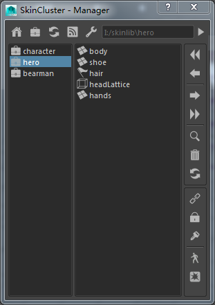

# Skin Weight Manager



Maya toolkit used to export / import skin weights.  

---

#### DEPENDENCY
- QtSide https://github.com/astips/QtSide


#### SUPPORT

* Poly Mesh  
* Nurbs Surface
* Nurbs Curve
* Lattice


#### INSTALLATION


1. Download the latest release and unzip the folder where you want to live.
2. Copy folder "tk_weight_manager" to `%USERPROFILE%\Documents\maya\mayaVersion\scripts`

#### USAGE
 
```python
from tk_weight_manager import startup
startup.show_manager()  
```

```python
from tk_weight_manager import startup
startup.show_toolkits() 
```